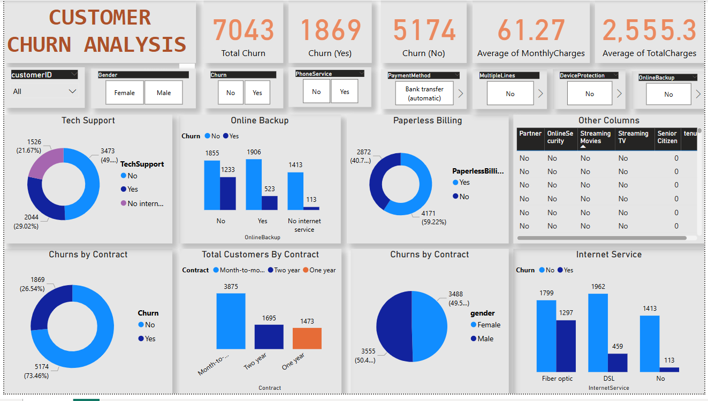

# Customer Churn Analysis - Power BI Dashboard

This Power BI dashboard analyzes customer churn data, showing churn trends by contract type, services, billing methods, and more.

## 📊 Key Insights
- Total Customers: 7043
- Churned Customers: 1869 (26.54%)
- Majority of churn comes from month-to-month contracts.
- Customers with fiber optic and paperless billing show higher churn rates.

## 🔧 Technologies Used
- Power BI
- Data Source: Telco Customer Churn Dataset

## 🖼️ Dashboard Preview

## 📁 Files
- `Customer Churn Analysis.pbix` – Main Power BI file
- `dashboard.png` – Dashboard preview

## 🚀 Project Badges

